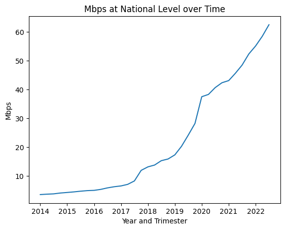

# Data Analysis for Telecommunication Services Company ConectAR

## Context

The telecommunications industry plays a crucial role in facilitating communication and the transfer of information on an international scale. From the internet to fixed telephone lines and mobile telephony, the industry enables people to stay connected almost anywhere in the world.

Argentina has made significant progress in the development of its telecommunications infrastructure, with a large network deployed to cover its users, satellite technology development centers, and high-speed digital communications chips. Recent data shows that Argentina ranks above the world average in telecommunications development.

While Argentina has made significant strides in this area, there are still areas that could be improved from the costumers perspective. 

## Role

Working for a company that provides **telecommunications services**, I am commissioned to carry out a complete analysis that allows to recognize the *behavior of this sector at the national level*.

 Consider that the main activity of the company is to provide Internet access, then, the focus of the present analysis is to **identify growth opportunities** where to attract new customers.

## Data

The information used for this analysis was obtained from the datasets available at the official [ENACOM](https://datosabiertos.enacom.gob.ar/dashboards/20000/acceso-a-internet/) website, from the official website of the Argentine Internet Chamber - [CABASE](https://www.cabase.org.ar/wp-content/uploads/2019/12/CABASE-Internet-Index-II-Semestre-2019.pdf), and Telecommunication Churn analysis performed by [IBM Community](https://community.ibm.com/community/user/businessanalytics/blogs/steven-macko/2019/07/11/telco-customer-churn-1113).

## Objectives

The objective of this analysis is to identify potential areas of growth for **ConectAR**(fictional company) in Argentina. Specifically, we aim to identify areas where there is a high potential for new customers based on the following criteria:

+ Areas where the quality of services is poor
+ Areas where customers are pushing for high-quality internet access
+ Areas where the deployed network is outdated
+ Areas where there is a reduced number of competitors in comparison with the number of potential customers.

By analyzing data related to these criteria, we aim to provide recommendations for **ConectAR** to improve its market position and increase revenue in Argentina.

## EDA

During the performed EDA, the focus was on undertanding the available information, understanding general tendecies in a national context and provinces context, and identifing useful information to detect areas of interest.

In particular, the following items were considered:
+ Internet penetration level: This analysis indicated that there exist a growing tendency both at national and province level. However, there are several provinces that are noticeably relegated compatared with the national average.

+ Internet Access Technologies: Understand which are the relevant technologies in the market and which are their tendencies over time ( which are getting more predominant and which are getting outdated)

It could be identify that ADSL is getting outdated, and the users are preferring the Optical Fiber technology, which is growing rapidly since 2018.

Additionally, provinces whose networks are getting outdated  were identified:

+ Evolution of Internet Speed: This analysis enabled to understand the rate at which the average internet speed is increasing, which is the national average nowadays and which provinces are relegated in this sense. 

+ Market Share: Understand the market share of different areas can help to identify dominant players and regions of high and low competence.

## KPIs

Based on the EDA performed, different KPIs are here defined in order to bring insights regarding areas of potential growth.
This potential may relate to areas that are attractive for expanding the national relevance of a company providing internet access services (ISPs) or areas where efforts need to be focused because they have been neglected in the national landscape.

+ Customer Acquisition Rate: Measure the rate at which new customers are acquired in the targeted areas. This KPI helps to track the effectiveness of efforts in attracting and converting new customers.
  
  This KPI would indicate how much evolved the customer attraction by other companies in the last couple of years.
  A low acquisition rate would indicate that the companies have had a poor performance capturing new costumers in the area.

+ Service Quality Metrics: Track metrics related to service quality, such as network uptime, average internet speed, latency, and customer support response time. Improving these metrics can enhance customer experience and attract new customers.

  Based on other studies performed regarding Churn Rates, product dissatisfaction and competitors withe better/ faster devices" is the main reason for customers to change their ISP.
  Comparing the internet speed in an area with the national average, is an indicator of bad quality services.

+ Optical fiber / ADSL works as an indicator of how outdated is the techonology of the provided services in a zone.
  
  Based on additional reports from CABASE, Fibre optics is shaping up to be the next industry standard technology. And, therefore, it has become the preferred choice of ISPs for new installations.
  Similar to the previous one, this KPI aims to highlight areas where the deployed technology is turning outdated.

+ Market Share: Monitor the market share in the targeted areas.
  
  When identifying potential growth areas, it is important to identify the density of competitors or the number of suppliers competing in the same market segment.
  Therefore, this KPI seeks to point out areas where the number of potential customers is high in relation to the number of competitors.

+ Return on Investment (ROI): Measured as the potential number of new customers vs the area of new infrastructure of optical fiber or cable modem to deploy.
  
  Given Argentina's spiralling inflationary problems, comparing revenues in local currency generates a bias towards believing that the sector's turnover is steadily increasing.
  Therefore, this report chooses to consider the number of customers captured as a return, as they will be the ones paying for a service.
  Similarly, the investment to acquire such customers will be dominated by the infrastructural works that need to be carried out in order to provide service coverage. Therefore, the investment will be associated with the km2 to be covered to supply the customers.

## Conclusions

From the analysis of the obtained KPIs, areas of potential growth can be identified and compared.

Several aspects have been considered:
+ Sucess of previous customers capturing campaigns. This can be undestand in two ways. The first one is that the companies that are already established in the area are popular. The second one indicates that the population is interested in contracting an internet service.

+ Quality of services. Whether the internet speed is approtiated to the national context and considering if the deployed network is based on outdated technology or not.
Quality of service is the main churn reason for customers, therefore is a crucial aspect.

+ Market share, named how many companies compete for the same set of customers.

+ Potential customers density. It must be considered that infrastructure deployment is expensive. Therefore, it is important to target areas with high density of potential customers. Otherwise, the initial investment in infrastructure may not be profitable.

From the above, some provinces  proved to be tempting because they lead in several of the indicators:

+ Santiago del Estero presents a really outdated technology and bad quality of services. It also has a reduce number of competitors

+ San Luis presents a population demanding internet services in the last years. The deployed network is outdated and the quality of services is poor. It does not present a strong set of market competitors either.

+ Formosa present an average case with considerably high density of potential customers and a poor quality of services nowadays.